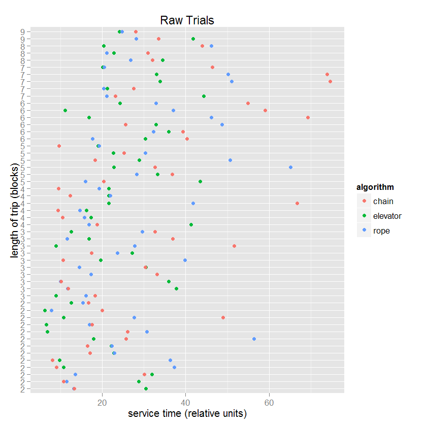
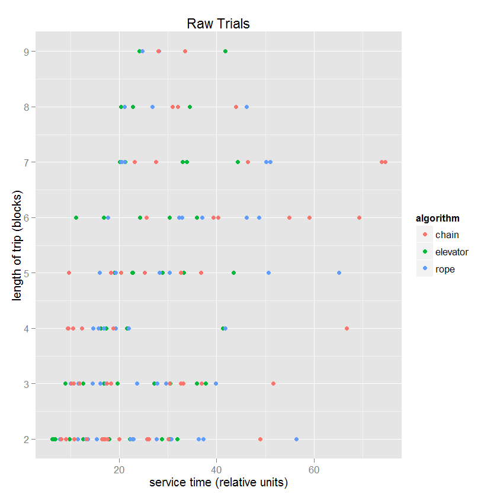
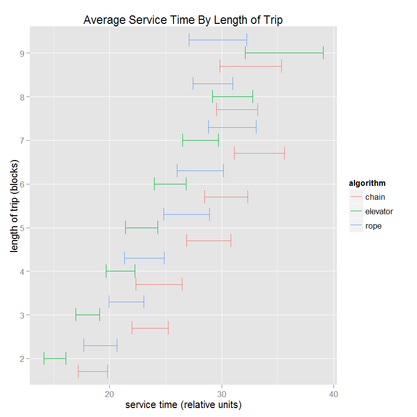
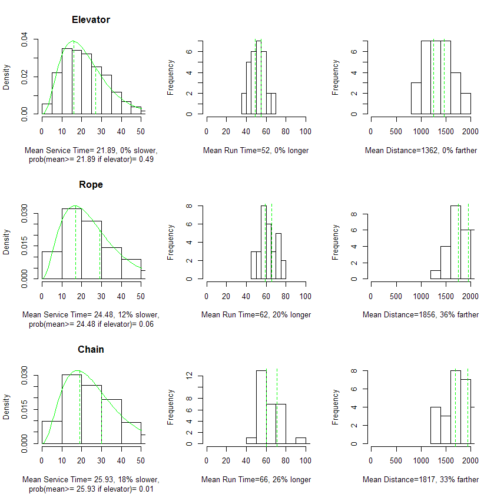
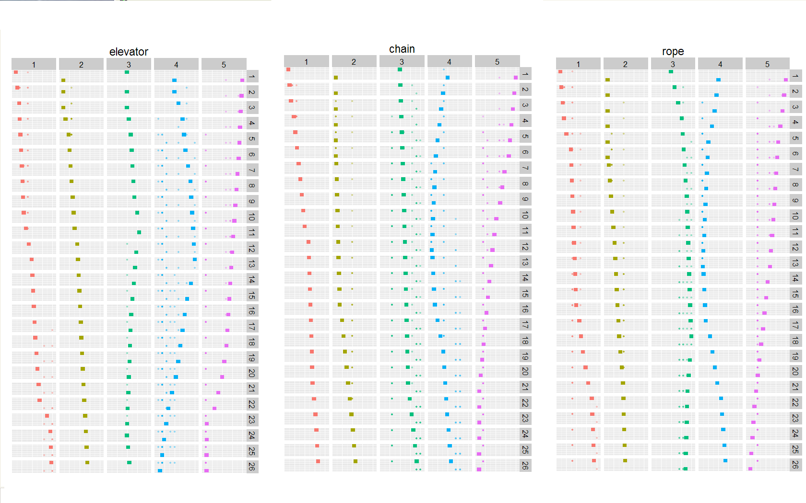
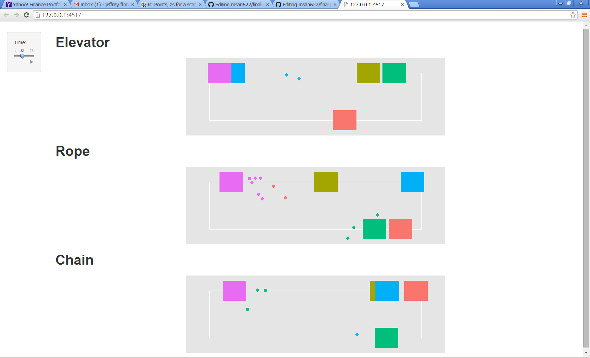

Final Project
==============================

| **Name**  | Jeffrey Flint |
|----------:|:-------------|
| **Email** | jeffrey.flint@gmail.com |

## Overview and Goals ##
I wrote a simulation that simulated three bus scheduling algorithms.  I want the below visualizations to be able to guide the viewer to conclusively evaluate which of the algorithms is the best.  I also want the viewer to develop a "feel" for how how each algorithm functions.  Finally, I want to be able to verify the accuracy of the simulation visually.

The simulation consisted of 30 bus passenger demand profiles that were simulated by each of the three scheduling algorithms. For each of the 30 simulations, there was a "bus file," that recorded the position of the bus and its arrival time to its next destination for each time period, and there was a "people file," that recorded the born, board, and arrival times as well as the origin and destination locations of each passenger.  For the visualizations below, these original files were transformed into the following files: (1) "pChart.csv" is the passenger file for the first iteration only.  (2) "pChartBig.csv" which is the same as (1) except for all 30 iterations. (3) "pfix.csv" which is time-by-time list of all passengers waiting for a bus for each bus. (4) "busfix.csv" is a time-by-time accounting of the position of each bus.

There were five buses scheduled.  There are 10 origins/destinations possible. 

## Raw Data Explorations ##
For the raw data visualizations, the data is in the file "pChart.csv".  The objective for these visualizations is to get a feel for the distribution and nature of the raw data and represent a progression of understanding of the data.  The first visualization is the raw passenger service times of the first iteration for algorithms.  The hope was that because each algorithm is scheduling exactly the same set of passengers, a graphic comparison of each of the passengers would be informative. It is somewhat useful in that it shows the expected trend that as the distance of the trip increases, the service time also increases, but it is difficult to ascertain if any algorithm is demonstrably better (though the outliers seem to be relegated to the "chain" algorithm).

In the second visualization, the service times for the first iteration are broken down by the length of the trip, a condesation of the first visualization.  Again, the outliers are the "chain" algorithm, but it is difficult to come away with any firm conclusions.

Both of these raw data visualizations have a low lie factor, a high data density and data/ink ratio.  However, it was difficult to generalize a conclustion with these single-sample views, with the possible exception that the "chain" algorithm may be producing outliers.  These raw visualizations did confirm that the data looks reasonable.

## Data Summary Visualizations ##

The first of the summary visualization also studies the relationship between service time, scheduling algorithm, and service distance, but now with all thirty iterations represented by error bars.  Some interesting patterns are clear.  The "elevator" algorithm is demonstrably better, except perhaps at the long distance trips.  The "elevator" algorithm also shows a linear relationshiop with the length of the trip.   And the "chain" algorithm is demostrably the worst algorithm.

I would have liked to include the raw data superimposed on this diagram, with each algorithm dodged and with the alpha low enough that the distribution could be seen visually, but I found it difficult to dodge geom_point.

The lie factor for this visualization is low.  The data density is high because of the power of statistical summaries, but the data/ink ratio is a little low.  Maybe by adjusting the x/y scales the data/ink ratio could be increased, but when I tried the error bars looked too compressed to me.

This is the grand-daddy of all statistical summary charts.  Very high data density and data/ink ratio, and a very low lie factor.  It is clear that the "elevator" algorithm is superior in all dimensions.  The text labels emphasize this conclusion by expressing averages relative to the elevator algorithm.

I would have liked to do this chart in ggplot, but because the first column is a density and the last two columns are frequency histograms, a grid in ggplot would not work.  Also, it is not possible to individually label each grid location in ggplot, so I stuck with the standard R plots.  It would have been nice to have been able to label each column, but that is not possible in standard R plots.

## "How Does It Work?" Visualizations

In the following visualizations, the viewer gets the opportunity to divine why the elevator algorithm is superior.  Both of these visualizations show the motion of the buses in their element, together with the people waiting for each bus.  Each bus acts like a "pacman" and eats up their respective passengers.  

The first visualization of the set shows how each bus behaves for the first 26 time periods of the simulation. It is clear that the "rope" and "chain" algorithms behave very similarly by comparing the shapes of the bus "waves".  But bus 3 and 4 of the "elevator" algorithm behaves visually much different than the other two, which also can be seen by the bus "waves" of busses 3 and 4 for all of algorithms.

The lie factor is quite low, the data density is quite high, and the data/ink rato is very high.

This last visualization is an interactive visualization.  (in the "bus" directory)  The benefit of making this visualization interactive is that the viewer can really study the methodology of the algorithms in play.  This visualization reenacts the entire simulation for the first iteration as a playback "movie".  Each algorithm is assigned the same bus starting positions and the same passenger demand profile, and the viewer can witness how exactly each algorithm gets its work done.

Some notables: The elevator algorithm has the ability to do u-turns at any point, while the other two algorithms can only do u-turns at the ends.  In the chain algorithm, buses are not allowed to pass the bus in front of them.

This visualization was helpful in finding problems in my simulation code!  I was able to spot a couple of behaviors that did not make sense that indeed were bugs.

## Prototype Feedback ##

My prototypes were very close to the final visualizations, except for the interactive visualization, which I had not yet conceived until I saw that "movies" were possible in shiny.  One suggestion that I took to heart was dodging the error-bars to better see them.

Regarding feedback I did not agree with, I did not receive any really.  All my reviewers were engaged and interested and provided positive support.  

## Challenges ##

- Getting the colors of discrete data to stay consistent.  A problem happens in some time slices where there were not passengers assigned to every bus.  The result is that the people waiting changed color from frame to frame. I had to force ggplot to respect the same colors by changing the color assignments based upon how many bus types were present.
- Getting geom_point to dodge.  As I said above, I would have liked to overlay a distribution of points over the error bars by dodging, but I could not get it to work.
- Having different geoms in different grid locations.  I solved by using standard R plots.
