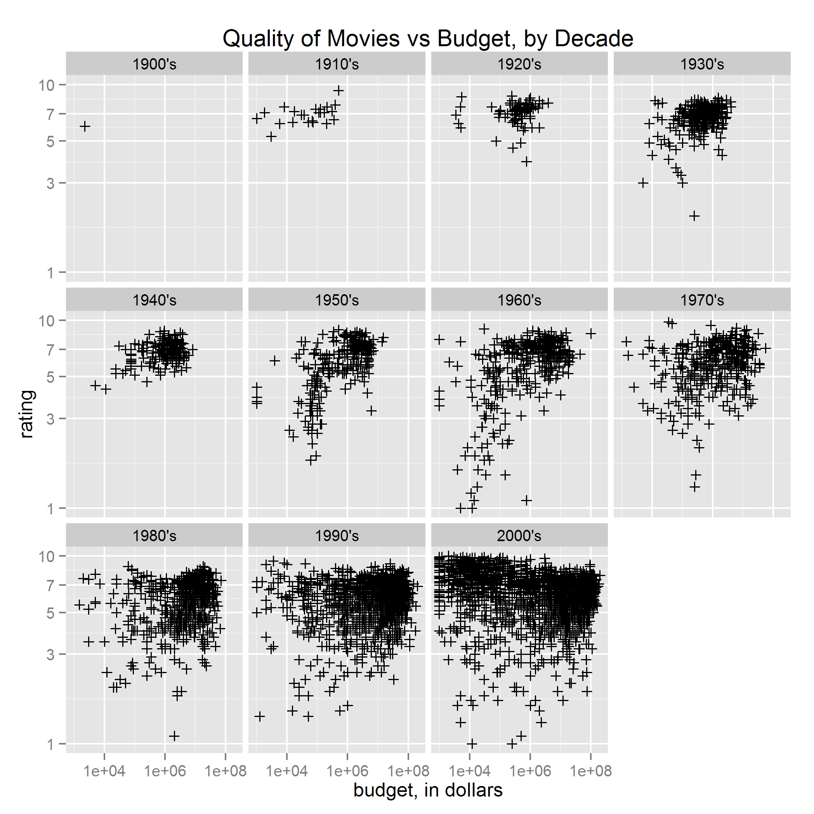

Homework 1: Basic Charts
==============================

| **Name**  | Jeffrey Flint |
|----------:|:-------------|
| **Email** | jeffrey.flint@gmail.com |

## Instructions ##

The following packages must be installed prior to running this code:

- `ggplot2`
- `reshape`

To run this code, please enter the following commands in R:

```
library(devtools)
source_url("https://github.com/matchbookiii/msan622/blob/master/homework1/hw1.R")
```

This will generate 5 images and some text output. See below for details.

## Discussion ##
### Scatter Plot ###

I used log scales on both axes to better spread-out the densly-packed data points.  I also used cross-hairs for the marks to also better prevent over-plotting.


### Bar Plot ###

I kept the color black since I felt that emphasized better the differernce in the movie counts.  I also sorted the genres based upon their counts since I found it useful to see the relative rank of each genre quickly.


### Small Multiples ###

I extended the concept of the first graphic to see how the rating/budget relationship varied by decade.



### Multi-line Chart ###

Labels not required for either the x- or y- axes since everything was explained by the title and legend.


