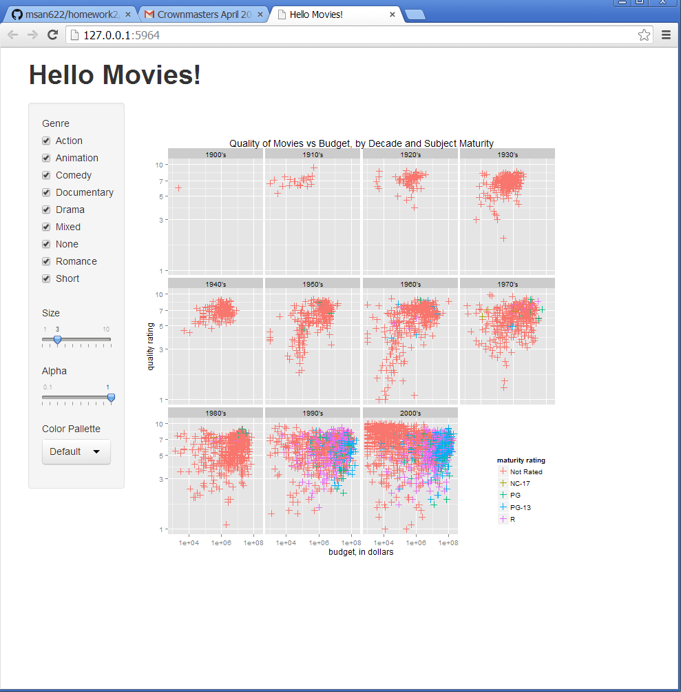

Homework 2: Interactivity
==============================

| **Name**  | Jeffrey Flint |
|----------:|:-------------|
| **Email** | jeffrey.flint@gmail.com |

## Instructions ##

The following packages must be installed prior to running this code:

- `ggplot2`
- `shiny`

To run this code, please enter the following commands in R:

```
library(shiny)
runGitHub("msan622", "matchbookiii", subdir = "homework2")
```

This will show an image in your default browser.

## Discussion ##


I used log scales on both axes to better spread-out the densly-packed data points.  I also used cross-hairs for the marks to also better prevent over-plotting.  I used the facet feature of ggplot2 because I like the way it showed trends: a drift towards bigger budgets over time, until the final decade, during which an eruption of low-budget, unrated films occurred.

I had a lot of trouble getting the scale of the faceted image to show up correctly in the browser.  In the resulting image, the legend is too small, the fonts are too small, and the image is not properly placed or sized for the browser window. I experimented with many options, but it didn't seem like ggplot2 could understand how big its destination rectangle was.  Part of the problem was that I fixed the y/x ratio with coord_fixed, which I needed to do so that the legend would appear in the correct location.  I have a file "graphic.r" in the submission directory that shows the plot as displayed in R, and which I was hoping to display in the browser.

For the "Default" pallette, I found some code on the internet that calculates the default pallette, given the number of factors.



