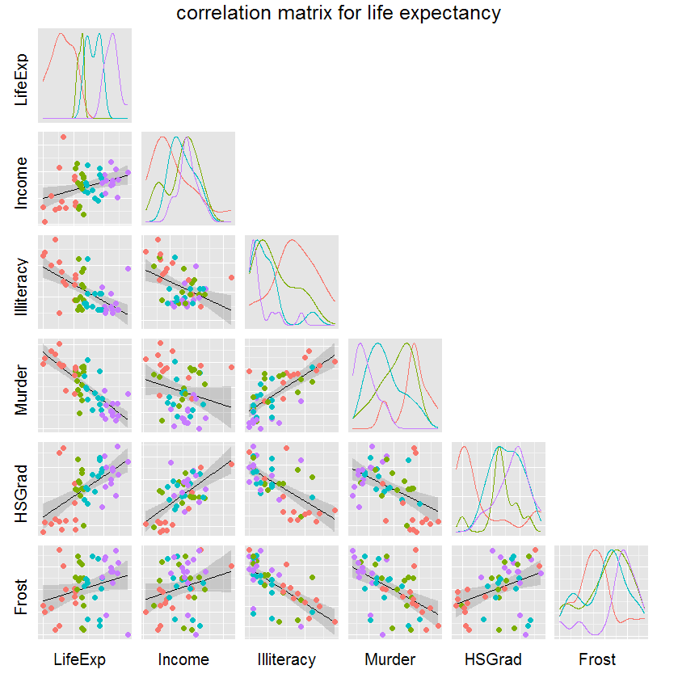
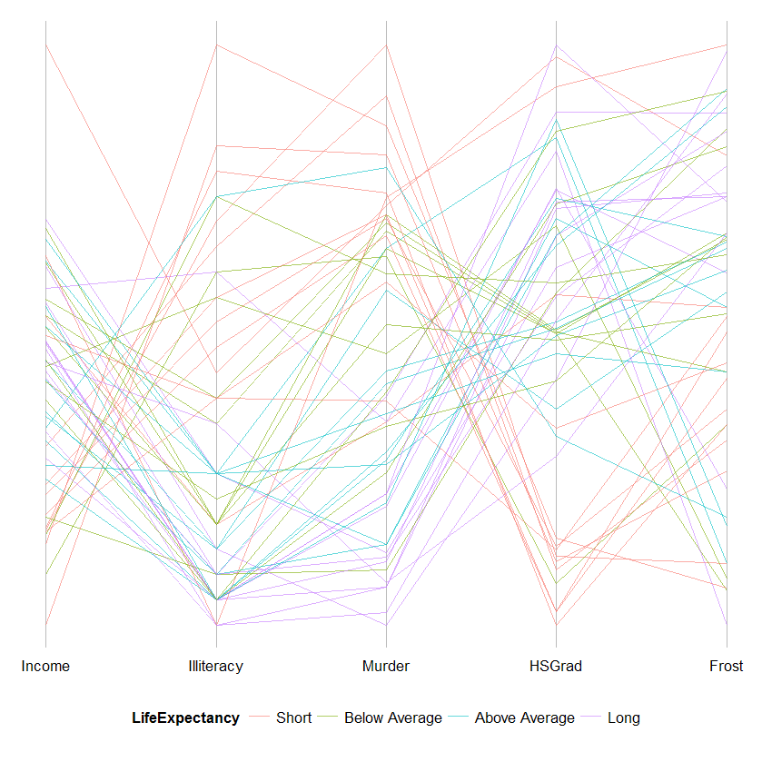
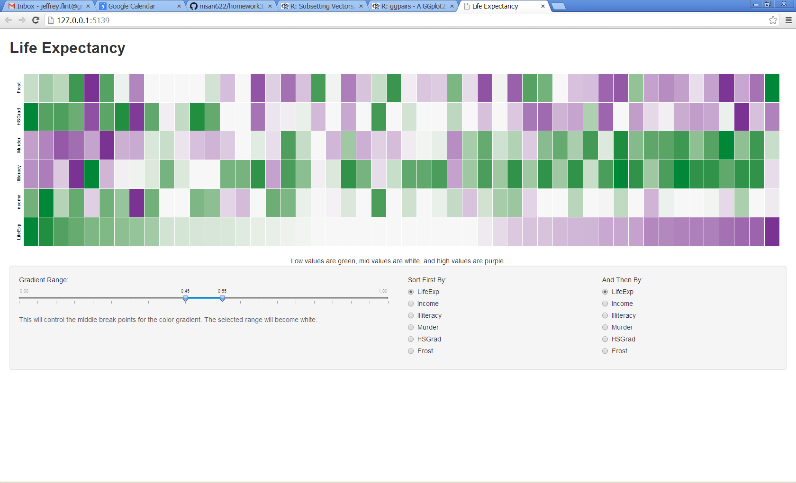

Homework 3: Multivariate
==============================

| **Name**  | Jeffrey Flint |
|----------:|:-------------|
| **Email** | jeffrey.flint@gmail.com |

## Instructions ##

The following packages must be installed prior to running this code:

- `ggplot2`
- `shiny`

To run this code, please enter the following commands in R:

```
library(shiny)
runGitHub("msan622", "matchbookiii", subdir = "homework3/combo")
```

This will show an image in your default browser.  

## Discussion ##

Overall, I was interesting in exploring which visualization technique would best help see predictors of Life Expectancy.

### Scatterplot Matrix ##

I created another discrete category with the members: "Short", "Below Average", "Above Average", and "Long" that correspond with the 1st, 2nd, 3rd, and 4th quartiles of LifeExp.   The idea is to see the distributions of each potential predictor with respect to the quartiles of Life Expectancy and to see if any combination of predictors increases the "clumping" and therefore the variance.  And it does a reasonably good job of it.  For example, murder and illiteracy concentrated the grouping for long-lived persons.



### Parallel Coordinates Plot ###

Continuing with the idea abouve, I used the same predictors as for the ScatterPlot and drew lines for each of the quartiles of Life Expectancy.  Strong patterns occur between murder, illiteracy, and HSGrad, just like the scatterplot.



### Heat Map ###

The heat map also shows the correlation between predictors for Life Expectancy.  In the heat map case though, I did not need to break out the separate discrete categories for Life Expectancy.  I changed the label on the second sort index to make it clear that it was the second-tier sorting element.



### Interactivity ###


