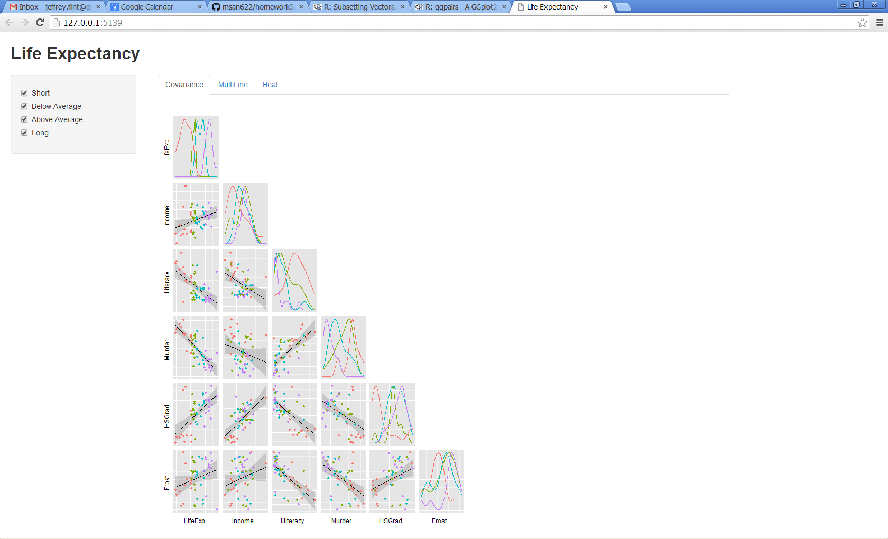

Homework 3: Multivariate
==============================

| **Name**  | Jeffrey Flint |
|----------:|:-------------|
| **Email** | jeffrey.flint@gmail.com |

## Instructions ##

<<<<<<< HEAD
The following packages must be installed prior to running this code:

- `ggplot2`
- `shiny`

To run this code, please enter the following commands in R:

```
library(shiny)
runGitHub("msan622", "matchbookiii", subdir = "homework3/combo")
```

This will show an image in your default browser.  

## Discussion ##

Overall, I was interesting in exploring which visualization technique would best help see predictors of Life Expectancy. I liked the "drill down" benefit the heat map provided for scatterplot and multiline plots.

### Scatterplot Matrix ##

I created another discrete category with the members: "Short", "Below Average", "Above Average", and "Long" that correspond with the 1st, 2nd, 3rd, and 4th quartiles of LifeExp.   The idea is to see the distributions of each potential predictor with respect to the quartiles of Life Expectancy and to see if any combination of predictors increases the "clumping" and therefore the variance.  And it does a reasonably good job of it.  For example, murder and illiteracy concentrated the grouping for long-lived persons.


### Parallel Coordinates Plot ###

Continuing with the idea abouve, I used the same predictors as for the ScatterPlot and drew lines for each of the quartiles of Life Expectancy.  Strong patterns occur between murder, illiteracy, and HSGrad, just like the scatterplot.


### Heat Map ###

The heat map also shows the correlation between predictors for Life Expectancy.  In the heat map case though, I did not need to break out the separate discrete categories for Life Expectancy.  I changed the label on the second sort index to make it clear that it was the second-tier sorting element.


### Interactivity ###

I pulled all of the above together with a checkbox that selects which quartile of Life Expectancy to display.  My plan was to brush away the unselected items so that the color of each quartile would remain constant, but I was not able to understand how to implement brushing in both the scatterplot and the multi-line plot.

I did change the low color of the heatmap to red, to better correspond to the default 1st quartile color of Life Expectancy.


=======
Use the following code to run this `shiny` app:

```
library(shiny)
runGitHub("msan622", "[username]", subdir = "homework3")
```

## Discussion ##

### Technique 1: [TYPE] ###


[DISCUSSION]

### Technique 2: [TYPE] ###


[DISCUSSION]

### Technique 3: [TYPE] ###


[DISCUSSION]

### Interactivity ###


[DISCUSSION]
>>>>>>> 54950a81fe30d3db96980eddf196831824bcd4c9


