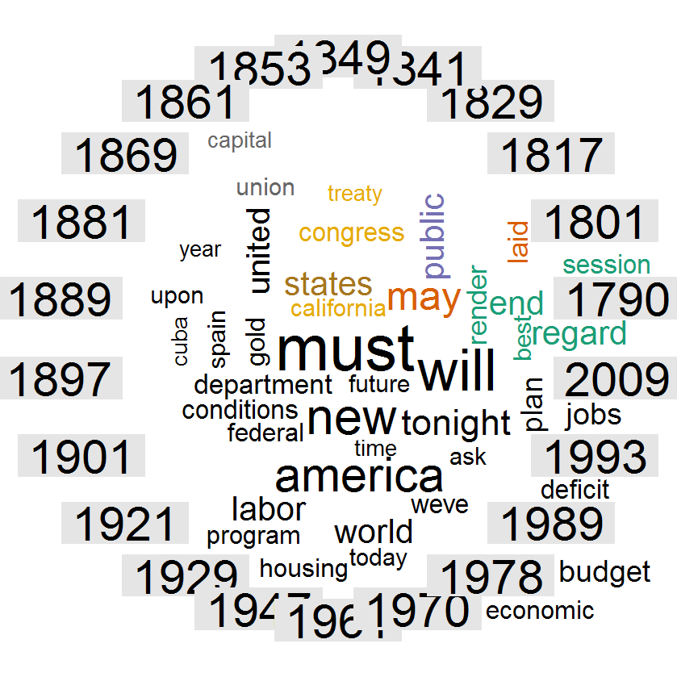
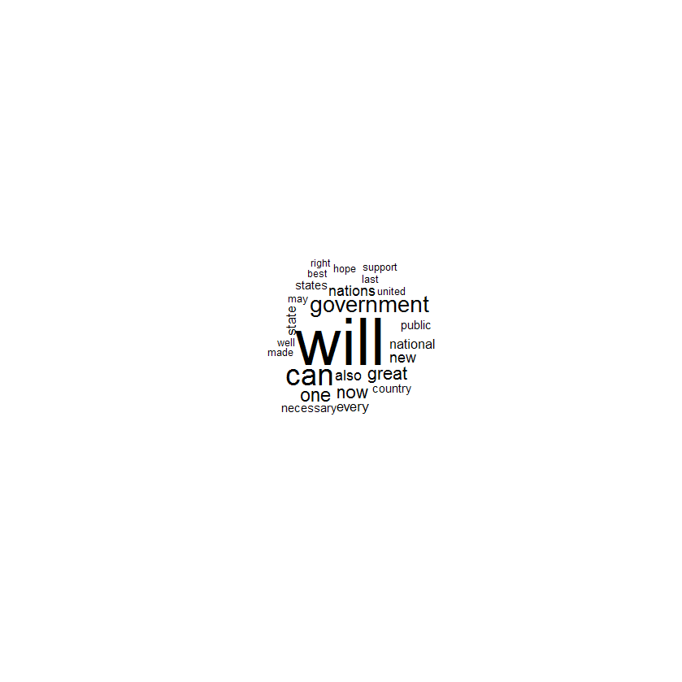
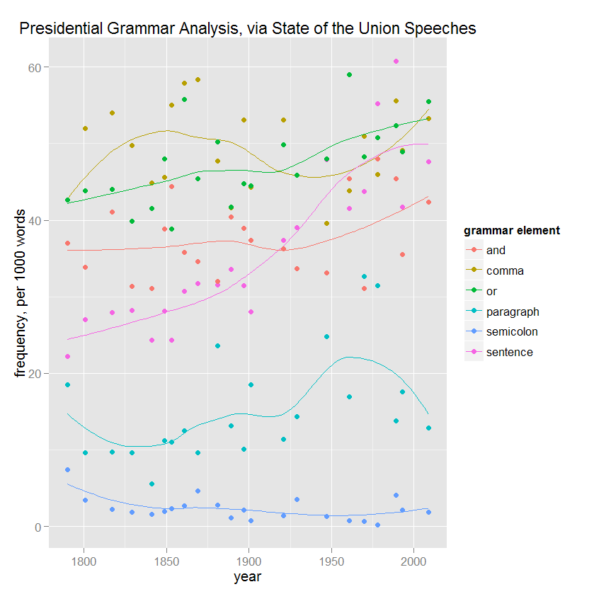

Homework 3: Multivariate
==============================

| **Name**  | Jeffrey Flint |
|----------:|:-------------|
| **Email** | jeffrey.flint@gmail.com |

## Instructions ##


To run this code, please enter the following commands in R:

```
library(devtools)
source_url("https://github.com/matchbookiii/msan622/blob/master/homework4/hw4.r")
```

This will show 3 images in R's viewer.

## Discussion ##

I gathered the first state-of-the-union speech of Presidents beginning with George Washington.  I gathered every-other President to prevent gathering too much data.  

### Comparison Cloud ##

This is a fun chart that shows the frequency of words by their proximity to their year.  I really liked the way the library made a circle of the years.  There is relatively high data/ink ratio, but these kind of displays make drawing firm conclusions difficult.  It looks to me like the frequent words are most often used in the "modern" era.

I did enjoy that "California" and "gold" were mentioned.  I found that using a max words of 75 had the right balance in the number of words displayed and the amount of information displayed.

I would have like to place a title on the plot and a legend to show what frequencies the color pallette corresponded to, but I didn't see how to do so in the help pdf.




### Commonality Cloud ###

This graphic show what words have the highest freqnency of all the state-of-the-union speeches.  I liked the negative space around the graphic that made it emphasize the austere.  After all, these words are the most commonly used by 22 presidents!

The stemming and other processing was the same as the previous graphic.  I did only show the 40 top words, again to emphasize the negative space.



### Grammar Comparison ###

I thought it would be a kick to see if how Presidents use language changed significantly over the years, so I wrote my own primitive word-processor using the power of grep to count the occurances of certain structural items of the prose. One advantage of doing do was that I was able to track punctuation marks like commans, semi-colons, and periods.

The most conclusive thing I found was that sentences are getting shorter.  Also, the use of "and" and "or" is increasing.  Poor ol' semi-colons.  It looks like George really liked them, but not other Presidents.

I tried looking into the frequency of other elements, like dollar signs vs "war" or "peace", but nothing compelling was revealed.  I was happy when I saw the #sentences/1000 words shoot up.




