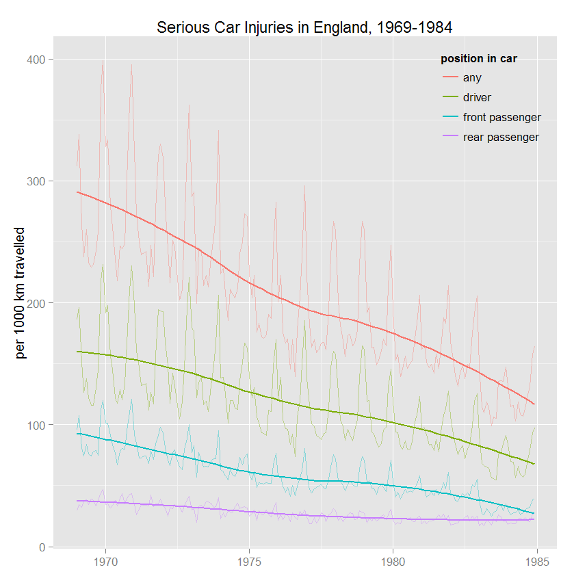
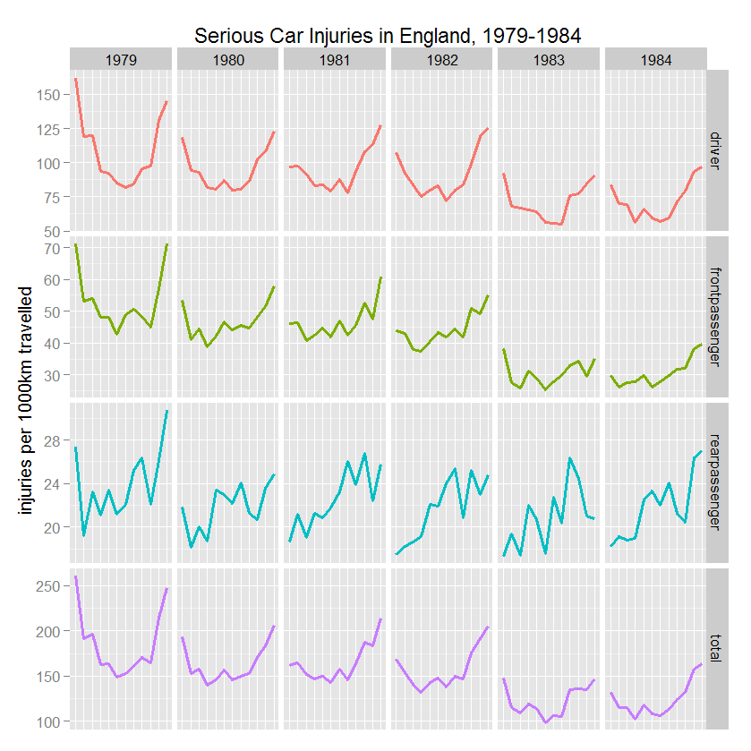
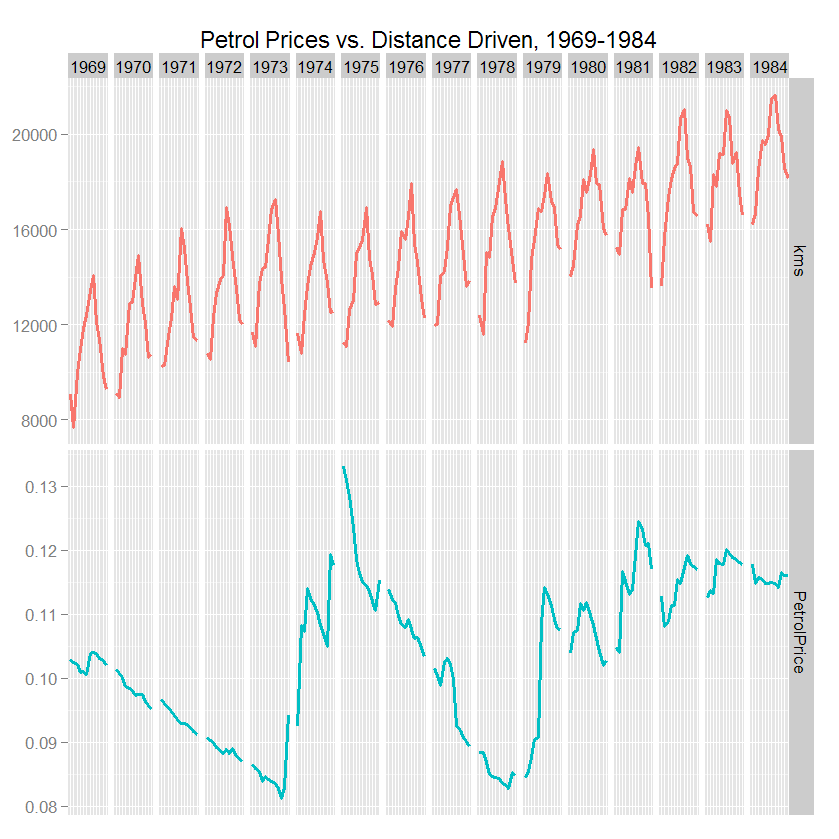

Homework 5: Time Series
==============================

| **Name**  | Jeffrey Flint |
|----------:|:-------------|
| **Email** | jeffrey.flint@gmail.com |

## Instructions ##

## Discussion ##

### Parallel Line Plot ###

By using a lower alpha for the time series and a higher alpha for the smoothing line, the complexity of the time series is available for study (note change after 1983) without being overwhelming, while the smoothing line summarizes the point-of-view of the visualization.  It is clear that the driver and front passenger injuries were the injuries mostly affected by the new seatbelt law in 1983, and it is also clear that there was already in place a trend of declining of injuries before the seatbelt law.

### Small Multiples Analysis of Before/After Seatbelt Law ###

This visualization offers a drill-down into the area immediately before and after the seatbelt law was introduced in Jan 1983. It continues to support the notion that the seatbelt law mostly affected the driver and front-seat passenger injuries.  

I turned of tick marks and labels on the x-axis to prevent messiness. 

### Small Multiples Analysis of Petrol Use vs Distance Driven ###

Continuing on with the small-multiples notion, I thought it would be interesting to see if fuel prices affected the number of miles that were driven.  Petrol prices had no effect on the distance driven, perhaps because the price fluctuations of petrol were not that great.

I used the free_y scale feature to loosen up the y scales so that the grid appears to be a continuous chart.

