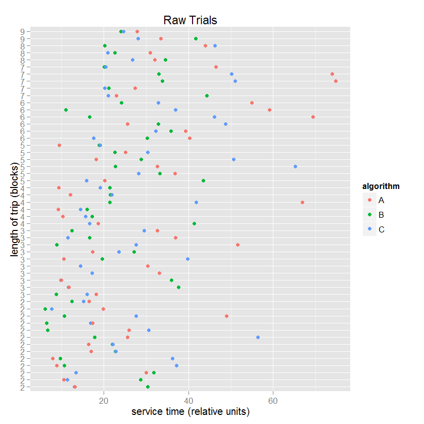
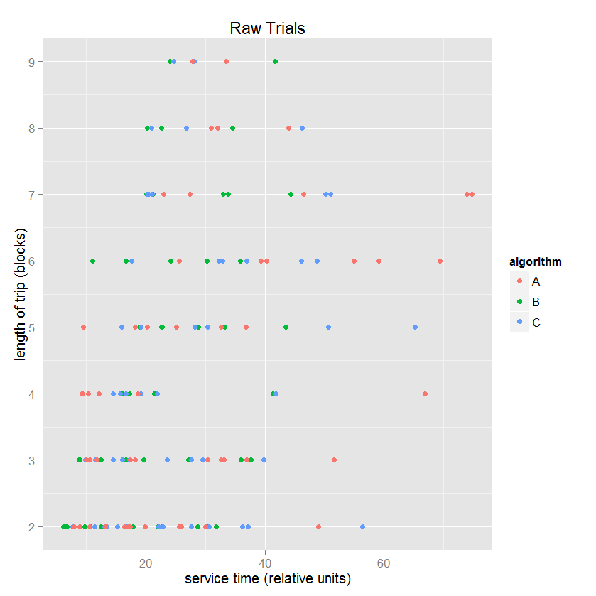
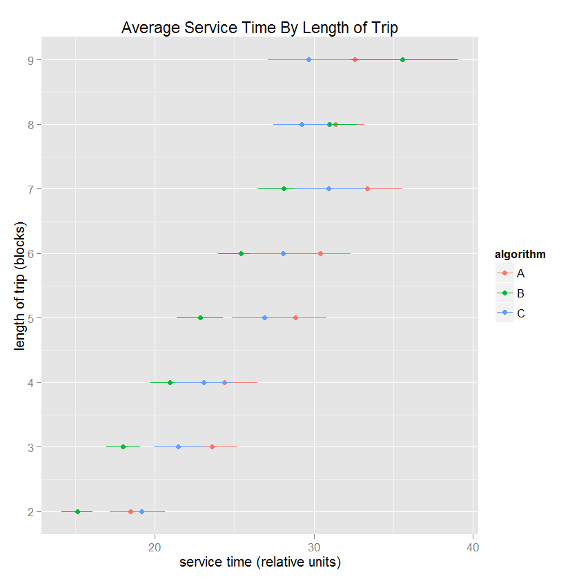
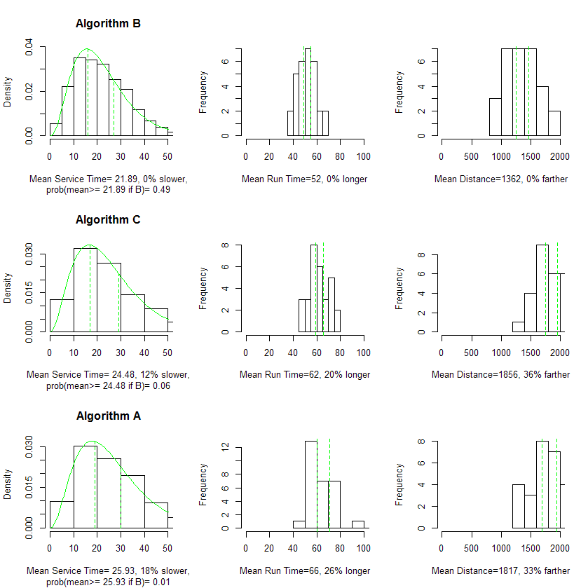

Project: Prototype
==============================

| **Name**  | Jeffrey Flint |
|----------:|:-------------|
| **Email** | jeffrey.flint@gmail.com |

## Discussion ##

I created a simulation to compare three bus scheduling algorithms.  I want the visualizations presented here to be able to convince the viewer which algorithm is best.

The data consists of 30 iterations for each algorithm.  Each iteration is a random sample of passenger demand based upon passengers "going home" from work. For each iteration, each algorithm is applied to the same sample so that the comparison is fair. 

###  Raw Data for One Iteration ###

The idea of this visualization is to show service times for one iteration.  Because each algorithm is evaluated under indentical circumstances (the passenger demand is identical), the comparison is "fair".   The hope is to induce a raw feel for the differences between the effects of each algorithm.  It would be possible to to show different iterations in an interactive setting, but this would probably be overwhelming.

###  Raw Data for One Iteration, By Length of Trip ###

An extension of the above idea, but instead organizing the data by the distance travelled.

###  Aggregate Data for all 30 Iterations, By Length of Trip ###

Statistically summarized version over all 30 iterations.  Previous graphics were of only a single iteration.

###  Distribution Analysis ###

Compared, for each algorithm, three distributions: (1) service time (as above); (2) total run time, which is an indicator of the capacity of the scheduling to generate revenue; (3) total bus distance, which is an indicator of maintenance costs.

###  Interactive Display ###

Some possibilities: (1) Show the above results for each passenger demand model. (2) Create a "movie" that would show the behavior of the buses under each algorithm.  
